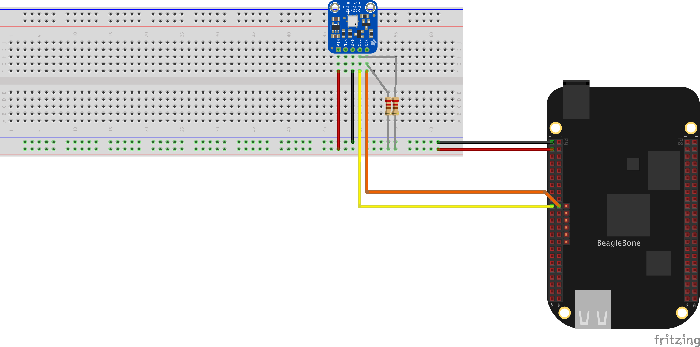

# BeagleBone Embedded Tutorial
_By: Rohan Daruwala (rdaruwala@wisc.edu)_

A tutorial to introduce people to BadgerLoop embedded software development by creating a BeagleBone Black driver for the BMP180 pressure sensor.

## Prerequisites 

At the minimum, you should be familiar with programming fundamentals (CS 300-ish), connecting to a linux computer via SSH, building basic circuits, and understanding binary & how data registers work (CS/ECE 252). Experience with basic C programming (CS/ECE 354) is recommended.

This tutorial uses the following devices:
	* [BeagleBone Black](https://beagleboard.org/black)
	* [BMP180 Pressure Sensor](https://www.amazon.com/OctagonStar-Temperature-Barometric-Pressure-Altitude/dp/B01MAXHEK0) (Your sensor may not look like this)
	* [Male/Male Jumper Wires](https://www.adafruit.com/product/1956)
	* [Breadboard](https://www.adafruit.com/product/64)
	* [2x 4.7 kOhm Resistor](https://www.exploringarduino.com/parts/4-7kohm-resistor/)

## Running the Tutorial

First, plug the BMP180 sensor into the breakout. Using the jumper wires and resistors, wire it up to the BeagleBone according to the following schematic:



Note that your sensor breakout may not look like the one in the picture. That's perfectly fine, just make sure that you're plugging the right wires into the right ports (VIN, GND, SCA, and SCL). If you know that your BMP180 breakout includes pull-up resistors, you can opt to remove them from your breadboard. If you don't know what a pull-up resistor is, don't worry. We'll explain it later. 

Once you've connected everything, turn on the BeagleBone and connect to it via SSH. To verify that you've installed the sensor correctly, run the following command:

```bash
i2cdetect -r 2
```

You should see a screen similiar to the following:


//todo insert pic


If you see `0x77`, this means that the BMP180 is correctly installed!

Next, clone this repository:

```bash
sudo apt-get install git
git clone https://github.com/rdaruwala/embedded-tutorial
```

Compile the program with the following commands:

```bash
cd embedded-tutorial
make
```

Finally, run it:


```bash
./bmp180
```

And you'll see an output looking like:

//todo insert pic